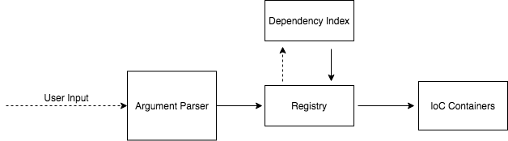
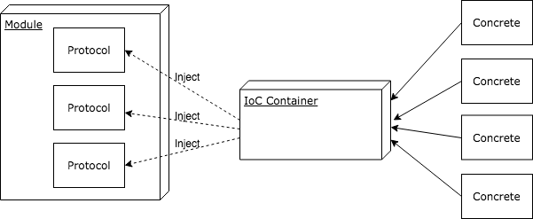
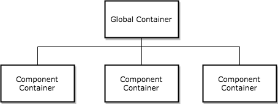
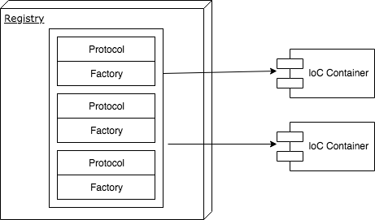
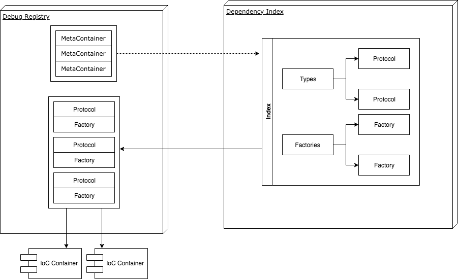
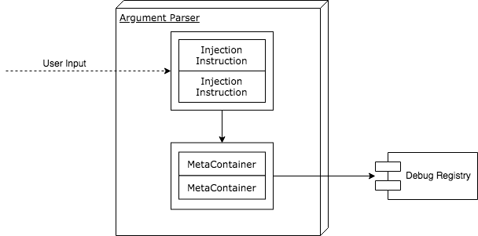
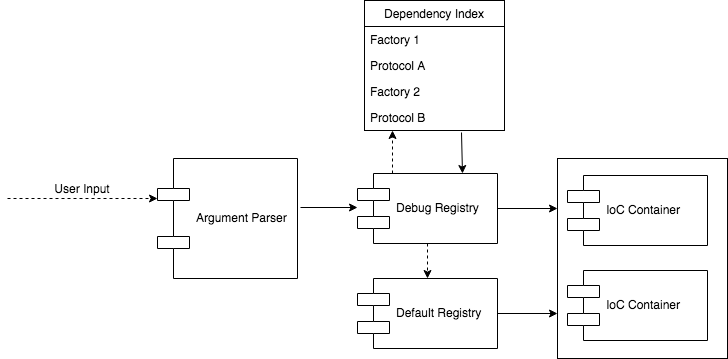

# Dynamic Dependency Injection

## Abstract

This document outlines the Relay architecture, which enables runtime-configurable dependencies for the purpose of focused integration testing, especially in cases where module dependencies are not readily accessible. For iOS, macOS, and tvOS, the most-common scenario is UI testing.

## System Architecture

The DDI architecture involves a combination of systems interacting with each other. The method for the end-result dependency injection uses a standard pattern known as an IoC Container, or a DI Container. The rest of the system feeds directly into these containers, which is what makes the dependency injection _dynamic_.



### IoC Containers

To understand this system, it's fundamental to first understand the concept of [dependency injection and containers](https://martinfowler.com/articles/injection.html). IoC stands for "Inversion of Control", which is a design principle in which the "control" of the program comes from a generic framework, often provided from outside of the system itself. To conform to this principle, we aim to adhere to the Dependency Inversion principle, in which any given module must depend on abstractions (interfaces/protocols) and not concretions.

IoC containers often either replace or supplement dependency injection via constructors. Very similar to the Service Locator pattern, IoC containers are responsible for resolving all dependencies and injecting them at scope or globally across the system.



In our implementation, containers can either be scoped **globally** or **individually**. We refer to individual container scope as "component-scope". There is only ever one global container, and all containers at component-scope fall back to the global container for dependency resolution.



### Dependency Registry

IoC container dependencies are typically registered via some static runtime config. We've isolated this responsibility to any type that conforms to `DependencyRegistryType`:

```swift
protocol DependencyRegistryType {
  func registerDependencies()
}
```

One important thing to note: dependencies are lazy-loaded, meaning that **containers deal with factories and not with concrete instances**. It is up to a dependency registry to register concrete factories for every container type.



### Dynamic Registry

What makes dependency injection truly dynamic is the `DynamicDependencyRegistry`. This registry uses a list of objects that describe an IoC container and its dependencies, called `DependencyMetaContainer`'s, to identify all types, factories, and associated scopes for registration. It does so by performing lookups on a `DynamicDependencyIndex`, which indexes all potential types and factories that might be dynamically injected.

To ensure all types are resolvable, it's suggested that default dependencies are first registered separately by the consuming program so that unresolved types fall back to registered defaults.



### Command Line

One entrypoint to the dynamic registry is through application launch arguments. This is handled with a `DependencyArgumentParser`, which takes in a list of command line arguments -- usually, `CommandLine.arguments`

Using the same type/factory keys as the dependency index, a user can provide a list of _dependency injection instructions_, which the argument parser converts to a list of `DependencyMetaContainer` and provides to the dynamic registry.



### The Full Picture

Tying it all together, these three high-level systems interact with each other:
1. The user provides a list of instructions via launch arguments, which are interpreted by the Argument Parser
1. The Argument Parser transforms these instructions to a list of Meta Containers, which are handed off to the Dynamic Registry
1. The Dynamic Registry looks up all required types and factories from the Dependency Index
1. The registries register all resolved types and factories to the respective IoC containers, which will then inject dependencies throughout the program


